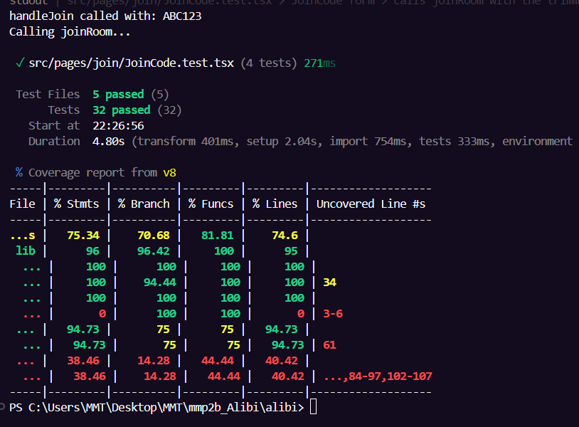

# Testing-Doku  Alibi (MMP2b)

## 1. Was war unser Ziel der Tests?

Unser Ziel war **Confidence**, nicht maximale Coverage. Wir wollten die Teile
testen, bei denen ein Bug am teuersten wäre – also die **kritische Spiellogik**
und die **wichtigste Nutzer-Interaktion**:

- Die Rollenverteilung (`assignRoles`) und die Gewinnbedingungen (`checkWin`)
  sind das Herz des Spiels. Ein Fehler hier macht eine ganze Runde kaputt.
- Das Beitreten zu einem Raum (`JoinCode`) ist der erste Schritt für jeden
  Mitspieler – wenn die Validierung hier bricht, kommt niemand ins Spiel.

Wir haben uns an der 80/20-Regel aus der Vorlesung orientiert: die ~20 % des
Codes testen, die 80 % der Bugs verursachen (Logik, Validierung, conditional
rendering, abgeleitete Zustände).

## 2. Was haben wir getestet? (mit Beispielen)

### Unit Tests (pure Logik)

| Funktion | Datei | Getestete Fälle |
|----------|-------|-----------------|
| `checkWinCondition` | `src/lib/checkWin.test.ts` | Citizens gewinnen, Conspirators gewinnen (Gleichstand & Mehrheit), Spiel läuft weiter, Investigator zählt als Citizen, tote Spieler ignoriert, leere Liste |
| `getEliminatedPlayer` | `src/lib/checkWin.test.ts` | meiste Stimmen, Gleichstand → null, keine Stimmen → null |
| `getTiedPlayers` | `src/lib/checkWin.test.ts` | Gleichstand liefert alle Beteiligten, klarer Sieger → leeres Array |
| `getConspiratorCount` | `src/lib/assignRoles.test.ts` | Grenzwerte 6 → 1, 7 → 2 |
| `assignRoles` | `src/lib/assignRoles.test.ts` | jeder Spieler bekommt Rolle, genau N Conspirators, Investigator nur ab 6 Spielern, IDs bleiben erhalten, Team passt zur Rolle |
| `generateRoomCode` | `src/lib/roomUtils.test.ts` | Länge 6, nur A–Z/0–9, Codes sind unterschiedlich |
| Sound-Mute-State | `src/utils/sound.test.ts` | Default nicht gemutet, persistieren, Toggle |

**Konkretes Beispiel** – Gewinnbedingung bei Gleichstand:

```ts
test('conspirators win when they equal the number of citizens', () => {
  const players = [
    { id: '1', role: 'conspirator', status: 'alive' },
    { id: '2', role: 'citizen', status: 'alive' },
  ]
  expect(checkWinCondition(players)).toBe('conspirators')
})
```

→ Commit: [67fa1ce]

### UI Tests (Interaktion)

`src/pages/join/JoinCode.test.tsx` testet das Beitritts-Formular **wie ein User**:

- leerer Code abgeschickt → Fehlermeldung „Please enter a room code"
- Code zu kurz (`ABC`) → Fehlermeldung „must be 6 characters"
- Eingabe wird automatisch groß geschrieben (`abc123` → `ABC123`)
- gültiger Code → `joinRoom('ABC123')` wird aufgerufen

→ Commit: [67fa1ce]

## 3. Was haben wir NICHT getestet (und warum)?

- **Audio-Wiedergabe** (`playSound`, `playLoopingSound`): reine Browser-/Library-
  Funktionalität (`HTMLAudioElement`). Laut „What not to unit test"-Folie testen
  wir keine Library-Internals. Nur unsere eigene Mute-State-Logik wird getestet.
- **`supabase.ts`**: nur Client-Initialisierung, keine eigene Logik.
- **Supabase-Calls in den Hooks** (`useJoinRoom` etc.): das wären Integration-/
  E2E-Tests gegen eine echte DB. Im UI-Test haben wir den Hook stattdessen
  **gemockt**, um deterministisch zu bleiben (kein echtes Netzwerk).
- **Reine Layout-/Styling-Komponenten** (`PlayerAvatar`, `PageLayout`): keine
  Logik, nur Darstellung – ein Test würde nur die Struktur spiegeln und wäre brittle.

## 4. Wie haben wir getestet? (Setup)

**Stack** (wie in der Vorlesung):
- **Vitest** als Test-Runner
- **React Testing Library** zum Rendern + Finden von Elementen wie ein User
- **jsdom** als Browser-Simulation
- **@testing-library/jest-dom** für Matcher wie `toBeInTheDocument()`
- **@vitest/coverage-v8** für den Coverage-Report

**Installation:**
\```bash
npm install -D vitest @testing-library/react @testing-library/jest-dom \
  @testing-library/user-event jsdom @vitest/coverage-v8
\```

**`vitest.config.ts`:**
\```ts
import { defineConfig } from 'vitest/config'
import react from '@vitejs/plugin-react'

export default defineConfig({
  plugins: [react()],
  test: {
    environment: 'jsdom',
    globals: true,
    setupFiles: ['./src/test/setup.ts'],
    coverage: { provider: 'v8' },
  },
})
\```

**Test-Befehl:** `npm run test:coverage`

→ Commit: [67fa1ce]

## 5. Welche Schwierigkeiten hatten wir?

- **`assignRoles` nutzt `Math.random`** zum Mischen. Man kann also nicht testen,
  WER welche Rolle bekommt. Lösung: wir testen **Invarianten**, die immer gelten
  müssen (Anzahl Conspirators, genau ein Investigator ab 6 Spielern, IDs bleiben
  erhalten), statt konkreter Ergebnisse.
- **`JoinCode` hängt an react-router und am Supabase-Hook.** Direktes Rendern hat
  nicht funktioniert, weil `PageLayout` `useNavigate()` braucht und der Hook auf
  die DB zugreift. Lösung: den Hook mit `vi.mock` ersetzen und die Komponente in
  einen `<MemoryRouter>` wrappen.
- **localStorage in Tests**: zwischen den Sound-Tests musste der State
  zurückgesetzt werden, sonst beeinflussen sich Tests gegenseitig → `beforeEach`
  mit `localStorage.clear()`.

## 6. Was mussten wir an der Codebase ändern?

Erfreulich wenig – die Logik war bereits sauber von der UI getrennt
(`src/lib/`, `src/utils/`). Das entspricht genau der „Separation of Concerns"
aus der Vorlesung und hat das Testen leicht gemacht: die pure-logic-Funktionen
ließen sich direkt importieren und testen, ohne sie umschreiben zu müssen.

Konkret hinzugefügt:
- `vitest.config.ts` + `src/test/setup.ts` neu angelegt
- Test-Scripts in `package.json` ergänzt (`test`, `test:run`, `test:coverage`)

Es war **kein Refactoring der Spiellogik nötig** – das werten wir als positives
Zeichen für die bestehende Architektur.

→ Commit: [67fa1ce]

## 7. Coverage / Anzahl Tests

Ergebnis nach `npm run test:coverage`:

- **5 Test-Dateien, 32 Tests, alle grün**
- `src/lib`: 96 % Statements, 100 % Functions
  (`assignRoles.ts` & `roomUtils.ts` je 100 %, `checkWin.ts` 100 % Lines)
- `JoinCode.tsx`: ~95 %

